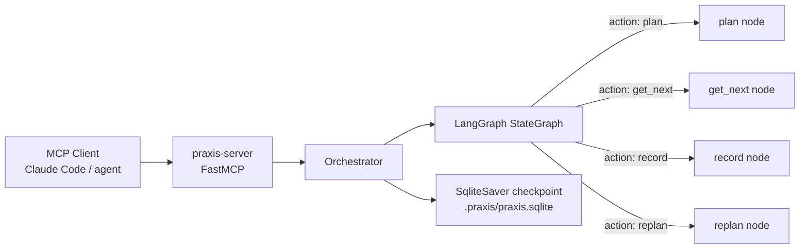

# Praxis

Praxis is a LangGraph task-orchestration engine exposed over the Model Context
Protocol (MCP). It turns a goal — or a structured Markdown spec — into an
ordered plan of subtasks, hands them out one at a time, records their outcomes,
and keeps the whole session on disk so it survives a process restart.

A coding agent drives Praxis through seven MCP tools: it plans, asks for the
next subtask, reports success or failure, and resumes exactly where it left off
after a crash or restart.

## Why Praxis

- Keep multi-step task state outside the agent's context window.
- Hand out subtasks one at a time, gated by their declared dependencies.
- Persist every session to SQLite so a restart loses nothing.
- Replan failed subtasks without discarding completed work.
- Isolate each task on its own git worktree and `praxis/<id>` branch.

## Architecture

Praxis is a single-step, action-routed `StateGraph`. Every MCP call routes on an
`action` channel, runs exactly one node, and ends. State persists between calls
through the checkpointer — that is what makes a session resumable.



| Module | Responsibility |
| --- | --- |
| `praxis/server.py` | FastMCP server exposing the seven MCP tools |
| `praxis/orchestrator.py` | Seam between MCP tools and the graph |
| `praxis/graph.py` | Action-routed `StateGraph` definition |
| `praxis/nodes.py` | `plan` / `get_next` / `record` / `replan` node functions |
| `praxis/state.py` | Serializable `TaskState` / `Subtask` / `History` schema |
| `praxis/checkpoint.py` | SQLite-backed checkpointer |
| `praxis/parser.py` | Markdown spec parser |
| `praxis/worktree.py` | Per-task git worktree manager |
| `praxis/health.py` | Health reporting (status / version / uptime) |

## MCP Tools

| Tool | Purpose |
| --- | --- |
| `praxis_health` | Report status, version, and uptime |
| `plan_task` | Create a session from a `goal` or a Markdown `spec` |
| `get_next_subtask` | Hand out the next actionable subtask |
| `record_result` | Record a subtask's success or failure |
| `replan` | Reset failed subtasks to pending for a retry |
| `praxis_resume_session` | Resume a session from its last checkpoint |
| `get_session_status` | Return the full current state of a session |

## Quick Start

Praxis runs on Python 3.11+ and is packaged with Poetry.

```bash
git clone https://github.com/sammyjdev/Praxis
cd Praxis

poetry install
poetry run praxis-server
```

`praxis-server` defaults to the **stdio** transport for local MCP clients. Set
`PRAXIS_TRANSPORT` to `streamable-http` or `sse` to run it as a networked
service.

Run it with Docker instead — this also starts the Redis service:

```bash
docker compose up --build
```

### Configuration

| Variable | Default | Purpose |
| --- | --- | --- |
| `PRAXIS_DB` | `.praxis/praxis.sqlite` | Checkpoint database path |
| `PRAXIS_TRANSPORT` | `stdio` | `stdio`, `sse`, or `streamable-http` |
| `PRAXIS_HOST` | `127.0.0.1` | Bind host for networked transports |
| `PRAXIS_PORT` | `8000` | Bind port for networked transports |

## Spec Format

`plan_task` accepts a small, structured Markdown spec. See
[`examples/spring-migration.md`](examples/spring-migration.md) for a worked
example.

- `# Heading` — the spec title.
- `> Goal: ...` or `Goal: ...` — the goal statement.
- `### N. Title` — one subtask; the leading number becomes its id.
- `depends_on: a, b` inside a subtask — its dependency ids.

Everything else under a subtask heading becomes its description.

## Typical Flow

```text
plan_task(spec)            -> session_id + ordered subtasks
get_next_subtask(id)       -> next subtask whose dependencies are all done
record_result(id, ok)      -> outcome logged, progress advanced
praxis_resume_session(id)  -> after a restart, continue from the checkpoint
```

## Development

```bash
poetry run pytest tests/praxis -q   # 23 tests, every acceptance criterion
poetry run ruff check
poetry run mypy src/praxis
```

## Legacy Prometheus Code

This repository previously hosted Prometheus, a context engine. That code is
**parked, not removed**: `src/prometheus`, `src/embedder`, `scripts`, and
`docker-compose.prometheus.yml` remain on disk and are excluded from the Praxis
linting, typing, and test scope.

## License

MIT — see [LICENSE](LICENSE).
