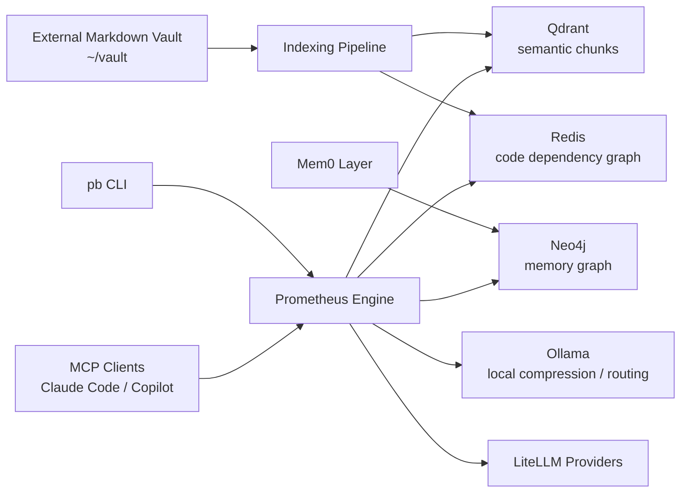
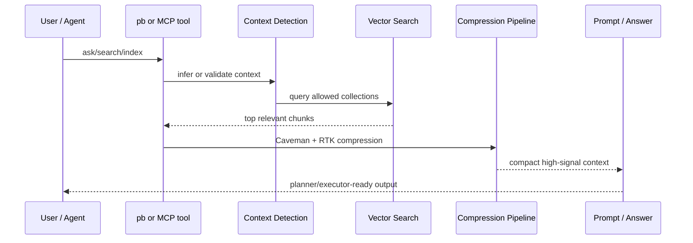

# Prometheus

Prometheus is a self-hosted context engine for engineers who want durable
project memory, local semantic retrieval, and safer AI-assisted workflows
without pushing their working context into a hosted knowledge base.

It keeps notes and code-adjacent knowledge in an external Markdown vault,
indexes that material into local stores, and exposes the result through a CLI
(`pb`) and an MCP server for coding agents.

## Why Prometheus

- Keep long-running technical context outside chat history.
- Retrieve only the relevant slices of knowledge for the current task.
- Separate general and restricted contexts with explicit guardrails.
- Compress retrieved context before handing it to larger models.
- Run the full stack locally with Docker, Ollama, Qdrant, Redis, and Neo4j.

## Architecture





## Core Capabilities

- Semantic search across Markdown notes, code chunks, and project memory
- Vault-first knowledge capture with TIL and HOW-TO workflows
- MCP tools for editor and agent integrations
- Code dependency graph storage in Redis
- Mem0-backed memory workflows using Neo4j
- Context isolation for restricted collections such as `work`
- Automatic or on-demand reindexing with `pb watch` and `pb index`

## Quick Start

Prometheus expects an external vault and a local clone of the engine. A common
setup is:

- `PROMETHEUS_ENGINE=/path/to/prometheus`
- `PROMETHEUS_VAULT=~/vault`

```bash
git clone <your-fork-or-repo-url> /path/to/prometheus
cd /path/to/prometheus

# Optional: when the engine runs on a Mac but the infrastructure
# (Qdrant/Redis/Neo4j/Ollama/Langfuse) lives on a desktop host
export PROMETHEUS_INFRA_HOST=192.168.x.x

./setup.sh
pipx install --editable .

set -a
source .env.local
set +a

# required only for cloud-routed Anthropic calls
export ANTHROPIC_API_KEY=your-anthropic-api-key
```

When `PROMETHEUS_INFRA_HOST` is set, `setup.sh` switches to remote-infra mode:
it writes remote service URLs into `.env.local`, validates the remote HTTP
endpoints it can reach, and skips local Docker startup and local Ollama model
pulls.

Bootstrap the external vault:

```bash
mkdir -p ~/vault/knowledge ~/vault/personal ~/vault/career
pb index ~/vault/knowledge --ctx knowledge
```

Then run a first query:

```bash
pb ask "How should I organize reusable technical notes?"
```

For the full vault layout, see [Vault setup](docs/VAULT_SETUP.md).

## Typical Workflow

```bash
# Create the first indexes
pb index ~/vault/knowledge --ctx knowledge
pb index ~/vault/personal --ctx personal
pb index ~/vault/career --ctx career

# Search and query
pb search "qdrant uuid ids" --ctx knowledge
pb ask "Summarize the current context for vector indexing"

# Capture knowledge
pb til "Qdrant rejects SHA1 hex ids; use uuid5 instead" --tags qdrant,ids
pb til --promote-today

# Keep the index warm
pb watch ~/vault/knowledge --ctx knowledge
```

## Context Model

Prometheus organizes data into separate collections:

| Context | Intended use |
| --- | --- |
| `knowledge` | technical notes, HOW-TOs, references |
| `career` | interview prep, companies, goals |
| `personal` | side projects, decisions, planning |
| `work` | restricted professional context |

`work` is intentionally guarded and should only be queried with explicit
context.

## CLI Surface

Main commands exposed by the current CLI:

- `pb ask`
- `pb search`
- `pb index`
- `pb index-dev`
- `pb watch`
- `pb til`
- `pb adr`
- `pb deep`
- `pb expand`
- `pb memory smoke`
- `pb cost`
- `pb rtk-status`

## Local Stack

Prometheus runs on Python 3.11+ and uses:

- Qdrant for vector search
- Redis for code dependency relationships
- Neo4j for Mem0 graph memory
- Ollama for local model execution
- LiteLLM for provider routing
- Typer for the CLI
- FastMCP for agent-facing tools

`setup.sh` selects the Docker profile automatically:

- `cpu` on macOS
- `gpu` on Linux machines with NVIDIA support

## Documentation

- [Vault setup](docs/VAULT_SETUP.md)
- [Usage guide](docs/USAGE_GUIDE.md)
- [Architectural decisions](docs/ADR.md)
- [Architectural requirements](docs/ARD.md)

## Notes

- The vault is external by design. Do not store vault content inside this
  repository.
- If you use non-default paths, export the matching environment variables
  before running `pb`.
- `setup.sh` generates `.env.local`, but it does not export those variables
  into your current shell session.
