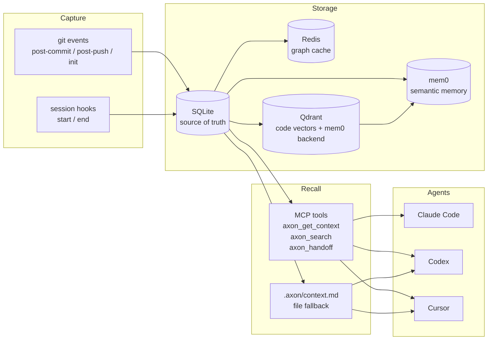

# AXON


**Same context, any AI coding agent.**

> *Agent-agnostic eXecution and cONtext Network.*

Every time you switch coding agents — from Claude Code to Codex to Cursor — or
resume a project after a few days away, your AI assistant starts blank. AXON
solves this by capturing context at the moments it crystallises (git commits,
session boundaries) and surfacing it on demand over MCP or a plain
`.axon/context.md` file that any agent can read. One install, continuous memory,
any agent.

---

## Quickstart

AXON is not yet on PyPI. Install from source:

```bash
git clone https://github.com/sammyjdev/axon.git
cd axon
pip install -e .
```

Initialize AXON in a repo (installs git hooks and indexes the code):

```bash
axon init /path/to/your-repo
```

Register the MCP server with your coding agent. For Claude Code, add this to
your project's `.claude/settings.json`:

```json
{
  "mcpServers": {
    "axon": {
      "command": "axon",
      "args": ["serve"]
    }
  }
}
```

`axon serve` runs the MCP server over stdio. Once registered, the tools
`axon_get_context`, `axon_capture`, `axon_handoff`, `axon_search`,
`axon_export_now`, `axon_validation_stats`, and `axon_health` are available
inside your agent session.

Every tool is classified by risk (`read` / `write` / `destructive`) and
emits structured trace records under a shared `trace_id` for tool-latency
and success-rate dashboards. The two destructive tools — `axon_export_now`
and `axon_mark_done` — require `AXON_ALLOW_DESTRUCTIVE=1` (or `true` /
`yes` / `on`) as a consent token. Writes to a RESTRICTED context
(`ctx=work`) are always denied with `DENY_RESTRICTED_TOOL_WRITE`. See
[ADR-013](docs/ADR.md#adr-013-tool-risk-classification-policy-gate-and-tracing-middleware)
and [dec-109](docs/decisions/dec-109-tool-tracing-and-risk-gating.md).

---

## Provider profiles

AXON routes cloud calls through a **profile** chosen by `AXON_PROVIDER_PROFILE`.
Two are built in:

| Profile | Models | When to use |
|---|---|---|
| `free` (default) | Groq Llama 3.1/3.3 + NVIDIA NIM Llama 3.1 70B (free tiers) | No API spend; rate-limited; fine on a 16 GB laptop without local models |
| `paid` | OpenRouter Claude Haiku/Sonnet/Opus (D2 tiers) + Groq paid | Higher quality and quotas; unified billing via OpenRouter |

Minimum setup (free):

```bash
export AXON_PROVIDER_PROFILE=free
export GROQ_API_KEY=gsk_...
export NVIDIA_NIM_API_KEY=nvapi-...
```

Each provider has a **rate-limit gate** (defaults: Groq 25/min and 13000/day,
NIM 50/min and 950/day) configurable via `AXON_<PROVIDER>_MAX_RPM` /
`AXON_<PROVIDER>_MAX_RPD`. When a cap is hit, calls fail with
`DENY_RATE_LIMIT` instead of being swallowed as model failures. See
[`dec-106`](docs/decisions/dec-106-routing-profiles.md) and
[`.env.example`](.env.example) for the full configuration surface.

Local Ollama is **opt-in** as of dec-106 (`AXON_PROVIDER_OLLAMA=1`). It remains
supported for users with capable hardware; D3 is unchanged.

---

## How it works



Capture is **event-driven only** — git commit/push/init and agent session
start/end. No background timer, no idle cost (see
[dec-104](docs/decisions/dec-104-event-driven-not-time-driven.md)).

Storage is: **SQLite** (source of truth) + **Redis** (graph cache) +
**Qdrant** (code vector search and mem0 backend) + **mem0** (semantic memory).
Neo4j was evaluated and dropped
([dec-101](docs/decisions/dec-101-revoke-d4-drop-neo4j.md)).

The primary transport is **MCP (stdio)**. A `.axon/context.md` file in the repo
is kept in sync as a fallback for agents without MCP support
([dec-103](docs/decisions/dec-103-cross-agent-mcp-primary.md)).

---

## Use cases

### Agent handoff without context loss

You spend an afternoon with Claude Code, push a branch, then continue the work
in Codex the next day. Without AXON, Codex starts cold. With AXON, the MCP tool
`axon_handoff` supplies Codex with the decisions, open questions, and code
index from the previous session — no copy-pasting required.

### Multi-day project continuity

On a project that spans weeks, the important context is not your last five
messages but the architectural decisions made three sprints ago. AXON captures
decisions from commit messages and session summaries into SQLite, so `axon
search` and `axon_get_context` return what actually matters, not stale history.

### Auto-generated architecture docs

AXON's LLM judge infers architectural decisions from commits and session events.
`axon export adr` and `axon export architecture` write structured Markdown notes
to an Obsidian vault, turning captured context into living documentation without
any manual ADR writing.

---

## How AXON compares

| | AXON | Aider | Cline | mem0 (standalone) |
|---|---|---|---|---|
| **Primary goal** | Agent-agnostic context continuity | Git-native AI pair programmer | AI agent inside VS Code | General-purpose semantic memory |
| **Context capture** | git events + session hooks | Conversation history | Conversation history | Explicit add/search API |
| **Works across agents** | Yes (MCP + file fallback) | No (Aider-specific) | No (Cline-specific) | Needs custom integration |
| **Git hook integration** | First-class (`pb hooks install`) | First-class (core feature) | No | No |
| **Self-hosted** | Yes | Yes | Depends on VS Code | Yes (open-source) |
| **Storage** | SQLite + Redis + Qdrant + mem0 | Flat files + git | Flat files | Qdrant / Postgres |

AXON's distinctive angle is agent-agnostic context continuity — it is not a
replacement for Aider's editing workflow or Cline's VS Code integration. If you
only use one agent and one machine, those tools' built-in histories may be
sufficient. AXON adds value when you switch agents, hand off between
collaborators, or need decisions to survive across long project timelines.

---

## Token savings

A modelled 20-turn coding session shows that AXON's selective context recall
reduces input token consumption by **52.3%** compared to a baseline that
re-supplies the full project context on every turn (87,000 tokens baseline vs.
41,500 tokens with AXON). This is a deterministic cost model — see
[`benchmarks/README.md`](benchmarks/README.md) for the assumptions, caveats,
and how to run it yourself.

Production telemetry across the turns where the compression pipeline actually
fired (inputs above ~180 tokens, `reduction_pct > 0`) in the committed
[`data/compression/stats.jsonl`](data/compression/stats.jsonl): **p50 = 57.5%**,
**mean = 58.2%**, **p95 = 84.7%**, **max = 91.6%** over **n=10 compressed
turns** out of 295 total telemetry records. The other 285 records are no-op
entries written by instrumented read-only tools (`get_graph_path`,
`get_graph_neighbors`, etc.) and by `engine=disabled`/`rtk` paths that
deliberately skip compression — they are excluded from the percentile bucket.
Reproduce with:

```bash
python -m axon.observability.compression_telemetry
```

The pipeline is gated by `strategy.enable_compression` and skips inputs too
small to benefit; see the issue tracker for active work on extending the
gate's coverage (T-105).

---

## Documentation

| Document | Contents |
|---|---|
| [`docs/SECOND_BRAIN.md`](docs/SECOND_BRAIN.md) | Run AXON as a low-cost second brain in Claude Code |
| [`CLAUDE.md`](CLAUDE.md) | Architecture decisions, code conventions, agent rules |
| [`docs/ADR.md`](docs/ADR.md) | Active architectural decision records |
| [`docs/METRICS.md`](docs/METRICS.md) | Recomputed performance metrics manifest (dated) |
| [`docs/ARD.md`](docs/ARD.md) | Architectural requirements |
| [`docs/USAGE_GUIDE.md`](docs/USAGE_GUIDE.md) | CLI workflows |
| [`docs/VAULT_SETUP.md`](docs/VAULT_SETUP.md) | Obsidian vault bootstrap |
| [`docs/decisions/`](docs/decisions/) | Individual decision records (dec-100 to dec-115) |
| [`docs/decisions/dec-106-routing-profiles.md`](docs/decisions/dec-106-routing-profiles.md) | FREE/PAID provider profiles + rate limit gate |
| [`docs/decisions/dec-109-tool-tracing-and-risk-gating.md`](docs/decisions/dec-109-tool-tracing-and-risk-gating.md) | Tool risk classes, policy gate, tracing middleware |
| [`benchmarks/README.md`](benchmarks/README.md) | Token savings benchmark |

---

## Contributing

Start from tests. The repo uses TDD: bugfixes begin with a regression test,
features need testable acceptance criteria before implementation.

```bash
pytest tests/ -q
```

See [`CLAUDE.md`](CLAUDE.md) for code conventions and agent rules.

---

## License

MIT — see [`LICENSE`](LICENSE).
