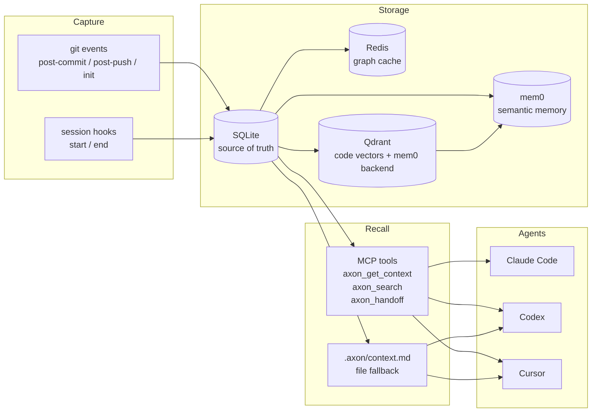

# AXON


**Same context, any AI coding agent.**

> *Agent-agnostic eXecution and cONtext Network.*

Every time you switch coding agents — from Claude Code to Codex to Cursor — or
resume a project after a few days away, your AI assistant starts blank. AXON
solves this by capturing context at the moments it crystallises (git commits,
session boundaries) and surfacing it on demand over MCP or a plain
`.axon/context.md` file that any agent can read. One install, continuous memory,
any agent.

---

## The stack

AXON is the front of a three-part, self-hosted context stack — install one
thing, get all three:

| Layer | Role | Project |
|---|---|---|
| **AXON** | Cross-agent memory + MCP orchestration (this repo) | `axon` |
| **GLYPH** | Graph-aware retrieval — decides *what* context to bring | [`glyph-kg`](https://github.com/sammyjdev/glyph-kg), pulled in via pip |
| **rtkx** | Context compression + reversible store — decides *how compact* | [`rtkx`](https://github.com/sammyjdev/rtkx), installed via `axon rtk-install` |

GLYPH and rtkx are clean, independently-tested dependencies, not a monolith.
The compressed context stays in the LLM window; the full pre-compression
original is one `restore_context` MCP call away (opt-in via
`AXON_RTK_REVERSIBLE`). Bundled compression layers like Headroom cover adjacent
ground — including reversible retrieval (its CCR cache) — but as one broad
engine. AXON instead keeps each tier narrow-and-deep and independently
swappable, so the graph (GLYPH) and compression (rtkx) layers can evolve, be
benchmarked, or be replaced on their own without touching the rest of the stack.

---

## Quickstart

AXON is not yet on PyPI. Install from source:

```bash
git clone https://github.com/sammyjdev/axon.git
cd axon
pip install -e .
```

This pulls in GLYPH automatically. Install the **rtkx** compression engine too
(downloads a prebuilt binary into `~/.axon/bin`, no Rust toolchain needed):

```bash
axon rtk-install
```

`axon doctor` then reports the whole stack (axon, rtkx, caveman, GLYPH).

Initialize AXON in a repo (installs git hooks and indexes the code):

```bash
axon init /path/to/your-repo
```

Register the MCP server with your coding agent. For Claude Code, add this to
your project's `.claude/settings.json`:

```json
{
  "mcpServers": {
    "axon": {
      "command": "axon",
      "args": ["serve"]
    }
  }
}
```

`axon serve` runs the MCP server over stdio. Once registered, the tools
`axon_get_context`, `axon_capture`, `axon_handoff`, `axon_search`,
`axon_export_now`, `axon_validation_stats`, and `axon_health` are available
inside your agent session.

Every tool is classified by risk (`read` / `write` / `destructive`) and
emits structured trace records under a shared `trace_id` for tool-latency
and success-rate dashboards. The two destructive tools — `axon_export_now`
and `axon_mark_done` — require `AXON_ALLOW_DESTRUCTIVE=1` (or `true` /
`yes` / `on`) as a consent token. Writes to a RESTRICTED context
(`ctx=work`) are always denied with `DENY_RESTRICTED_TOOL_WRITE`. See
[ADR-013](docs/ADR.md#adr-013-tool-risk-classification-policy-gate-and-tracing-middleware)
and [dec-109](docs/decisions/dec-109-tool-tracing-and-risk-gating.md).

---

## Provider profiles

AXON routes cloud calls through a **profile** chosen by `AXON_PROVIDER_PROFILE`.
Two are built in:

| Profile | Models | When to use |
|---|---|---|
| `free` (default) | Groq Llama 3.1/3.3 + NVIDIA NIM Llama 3.1 70B (free tiers) | No API spend; rate-limited; fine on a 16 GB laptop without local models |
| `paid` | OpenRouter Claude Haiku/Sonnet/Opus (D2 tiers) + Groq paid | Higher quality and quotas; unified billing via OpenRouter |

Minimum setup (free):

```bash
export AXON_PROVIDER_PROFILE=free
export GROQ_API_KEY=gsk_...
export NVIDIA_NIM_API_KEY=nvapi-...
```

Each provider has a **rate-limit gate** (defaults: Groq 25/min and 13000/day,
NIM 50/min and 950/day) configurable via `AXON_<PROVIDER>_MAX_RPM` /
`AXON_<PROVIDER>_MAX_RPD`. When a cap is hit, calls fail with
`DENY_RATE_LIMIT` instead of being swallowed as model failures. See
[`dec-106`](docs/decisions/dec-106-routing-profiles.md) and
[`.env.example`](.env.example) for the full configuration surface.

Local Ollama is **opt-in** as of dec-106 (`AXON_PROVIDER_OLLAMA=1`). It remains
supported for users with capable hardware; D3 is unchanged.

---

## How it works



Capture is **event-driven only** — git commit/push/init and agent session
start/end. No background timer, no idle cost (see
[dec-104](docs/decisions/dec-104-event-driven-not-time-driven.md)).

Storage is: **SQLite** (source of truth) + **Redis** (graph cache) +
**Qdrant** (code vector search and mem0 backend) + **mem0** (semantic memory).
Neo4j was evaluated and dropped
([dec-101](docs/decisions/dec-101-revoke-d4-drop-neo4j.md)).

The primary transport is **MCP (stdio)**. A `.axon/context.md` file in the repo
is kept in sync as a fallback for agents without MCP support
([dec-103](docs/decisions/dec-103-cross-agent-mcp-primary.md)).

---

## Use cases

### Agent handoff without context loss

You spend an afternoon with Claude Code, push a branch, then continue the work
in Codex the next day. Without AXON, Codex starts cold. With AXON, the MCP tool
`axon_handoff` supplies Codex with the decisions, open questions, and code
index from the previous session — no copy-pasting required.

### Multi-day project continuity

On a project that spans weeks, the important context is not your last five
messages but the architectural decisions made three sprints ago. AXON captures
decisions from commit messages and session summaries into SQLite, so `axon
search` and `axon_get_context` return what actually matters, not stale history.

### Auto-generated architecture docs

AXON's LLM judge infers architectural decisions from commits and session events.
`axon export adr` and `axon export architecture` write structured Markdown notes
to an Obsidian vault, turning captured context into living documentation without
any manual ADR writing.

---

## How AXON compares

The closest tools are other cross-agent memory/compression layers, not the
editing agents (Aider, Cline) whose histories are built-in and single-agent:

| | AXON | claude-mem | Headroom | Supermemory |
|---|---|---|---|---|
| **Primary goal** | Decision capture + cross-agent continuity | Auto-capture of all session activity | Token compression layer | Hosted cross-agent memory API |
| **What it captures** | Decisions at crystallisation points (git / session) | Every tool use, continuously | Whatever passes through (compresses it) | Facts / observations via API |
| **Reversible compression** | Yes (`restore_context`, rtkx) | No | Yes (CCR cache) | No |
| **Decision / ADR inference** | Yes (LLM judge → Obsidian) | No | No (failure-driven `learn`) | No |
| **Governance** | Per-tool risk class + restricted ctx (ADR-013) | `<private>` tags | A/B holdouts / measured savings | Access controls |
| **Works across agents** | Yes (MCP + file fallback) | Yes (MCP) | Yes (wrap / proxy) | Yes (plugins) |
| **Self-hosted** | Yes | Yes | Yes | Hosted-first |

The crowded part of this space is **raw recall** — tools like
[agentmemory](https://github.com/rohitg00/agentmemory) and Hindsight publish
strong LongMemEval scores and optimise for that directly. AXON does not compete
on that axis. Its defensible niche is the intersection none of the above
combine: capturing *decisions* (not every keystroke) at git and session
boundaries, inferring ADRs from them, keeping compression reversible, and gating
every MCP tool by risk class with a full audit trail. If you want the best raw
recall benchmark, those tools win; if you want decisions and architecture to
survive across agents and months, auditably, that is AXON.

---

## Token savings

AXON's numbers are measured by [GNOMON](https://github.com/sammyjdev/gnomon-eval)
with 95% confidence intervals, and every claim names its counterfactual
(gnomon-eval ADR-0011):

- **Quality uplift from recall** (vs no memory at all - A/B, N=17, judge x8,
  2026-07-02): faithfulness rises from 0.40-0.52 (no recall) to 0.72-0.76
  (recall on) at +2,151 input tokens per turn. After the retrieval ladder of
  2026-07-04 (index hygiene, skeleton-chunk suppression, hybrid lexical
  search), the recall arm reaches faithfulness 0.775 [0.735, 0.814] on the
  same cases.
- **Session cost** (vs re-sending the conversation - 10-turn sessions, 3
  stable runs, 2026-07-04): cost parity (pooled +4%), crossing to net savings
  at turn 6-9, with final-turn faithfulness at parity or better.
- **Real-usage savings** (vs reading each source file in full): 90.7% - 32,298
  tokens returned where the Read workflow would have cost 346,081 (100
  instrumented requests).

Retired: an earlier version of this section cited **52.3%** token savings.
That figure was a deterministic projection against an assumed 87,000-token
baseline - a model, never a measurement. It is kept in
[`benchmarks/model.py`](benchmarks/model.py) for provenance; the
projection-vs-measurement story is documented in gnomon-eval ADR-0011.

Measured compression telemetry from running the real pipeline (`phi3:mini`
via Ollama, caveman + RTK) over 69 representative technical context windows
(source and docs drawn from this repo), in the committed
[`data/compression/stats.jsonl`](data/compression/stats.jsonl): **p50 = 85.5%**,
**mean = 78.8%**, **p95 = 95.5%**, **max = 97.0%** over **n=69 compressed
windows** (75,258 → 15,778 tokens; 59,480 saved). Engines: 60
`caveman/phi3+rtk`, 9 `caveman/phi3`. This is a committed local snapshot over
representative context, not production usage.
Reproduce with:

```bash
python -m axon.observability.compression_telemetry
```

The pipeline is gated by `strategy.enable_compression` and skips inputs too
small to benefit; see the issue tracker for active work on extending the
gate's coverage (T-105).

---

## Documentation

| Document | Contents |
|---|---|
| [`docs/SECOND_BRAIN.md`](docs/SECOND_BRAIN.md) | Run AXON as a low-cost second brain in Claude Code |
| [`CLAUDE.md`](CLAUDE.md) | Architecture decisions, code conventions, agent rules |
| [`docs/ADR.md`](docs/ADR.md) | Active architectural decision records |
| [`docs/METRICS.md`](docs/METRICS.md) | Recomputed performance metrics manifest (dated) |
| [`docs/ARD.md`](docs/ARD.md) | Architectural requirements |
| [`docs/USAGE_GUIDE.md`](docs/USAGE_GUIDE.md) | CLI workflows |
| [`docs/VAULT_SETUP.md`](docs/VAULT_SETUP.md) | Obsidian vault bootstrap |
| [`docs/decisions/`](docs/decisions/) | Individual decision records (dec-100 to dec-120) |
| [`docs/decisions/dec-106-routing-profiles.md`](docs/decisions/dec-106-routing-profiles.md) | FREE/PAID provider profiles + rate limit gate |
| [`docs/decisions/dec-109-tool-tracing-and-risk-gating.md`](docs/decisions/dec-109-tool-tracing-and-risk-gating.md) | Tool risk classes, policy gate, tracing middleware |
| [`benchmarks/README.md`](benchmarks/README.md) | Token savings benchmark |

---

## Contributing

Start from tests. The repo uses TDD: bugfixes begin with a regression test,
features need testable acceptance criteria before implementation.

```bash
pytest tests/ -q
```

See [`CLAUDE.md`](CLAUDE.md) for code conventions and agent rules.

---

## License

MIT — see [`LICENSE`](LICENSE).
